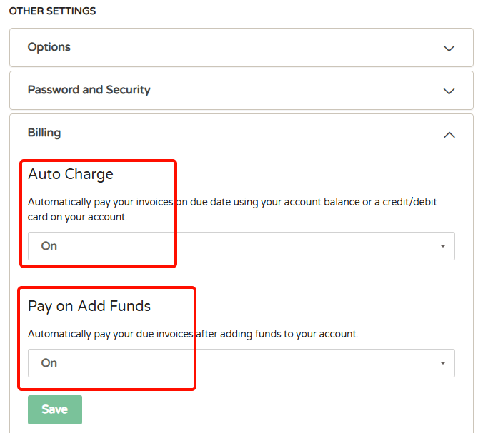

# cloudcone优惠码最新vps促销套餐整理

Cloudcone是目前最受欢迎低价便宜VPS之一，美国注册公司成立于2017年，主营美国洛杉矶 MultaCom 机房云服务器 / VPS、独立服务器等业务。

VPS 基于 KVM 虚拟，MultaCom 机房采用动态路由网络，会根据不同网络状态调整线路，不少地区电信网络会走 CN2 线路，延迟和稳定性在非高峰时段都较为优秀。

便宜VPS **年付** 低至10美元，支持支付宝和PayPal付款。同时该主机商提供按秒计费SC2服务器、随删随用、定期备份服务。

官方网站：[https://www.cloudcone.com](https://app.cloudcone.com.cn/?ref=465)

国内官方备用：[https://www.cloudcone.com.cn](https://app.cloudcone.com.cn/?ref=465)

## CloudCone 2025年9月新机房

CloudCone 刚上线一个新的数据中心：St. Louis, Missouri, USA，[St. Louis, MO](https://news.cloudcone.com/cloudcone-expands-with-a-new-location-hello-st.-louis-1dsPyE)

美国 St. Louis, US 机房，千兆带宽，1 个 IPv4 地址，3 个 IPv6 地址，基于 KVM 虚拟，SSD RAID 10 硬盘存储。

| CPU | 内存  | SSD硬盘 | 流量  | 带宽  | 价格  | 购买地址 |
| --- | --- | --- | --- | --- | --- | --- |
| 1核  | 1G  | 14G | 1T  | 1Gbps | $12.99/年 | [点击购买](https://app.cloudcone.com.cn/vps/415/create?ref=465&token=ssd-vps-stl-launch-1) |
| 2核  | 2G  | 26G | 2T  | 1Gbps | $19.59/年 | [点击购买](https://app.cloudcone.com.cn/vps/416/create?ref=465&token=ssd-vps-stl-launch-2) |
| 3核  | 3G  | 41G | 3T  | 1Gbps | $21.59/年 | [点击购买](https://app.cloudcone.com.cn/vps/417/create?ref=465&token=ssd-vps-stl-launch-3) |
| **4核(推荐)**  | 4G  | 55G | 4T  | 1Gbps | $23.59/年 | [点击购买](https://app.cloudcone.com.cn/vps/418/create?ref=465&token=ssd-vps-stl-launch-4) |
| 8核  | 8G  | 111G | 5T  | 1Gbps | $57.59/年 | [点击购买](https://app.cloudcone.com.cn/vps/419/create?ref=465&token=ssd-vps-stl-launch-5) |
| 10核  | 16G  | 223G | 6T  | 1Gbps | $125.69/年 | [点击购买](https://app.cloudcone.com.cn/vps/420/create?ref=465&token=ssd-vps-stl-launch-6) |

测速：https://lg-stl.us.cloudc.one

## CloudCone 2025年7月闪购活动

美国西海岸洛杉矶 MultaCom 机房，千兆带宽，1 个 IPv4 地址，3 个 IPv6 地址，基于 KVM 虚拟，SSD Cached RAID 10 硬盘存储。

| CPU | 内存  | 硬盘（SSD缓存） | 流量  | 带宽  | 价格  | 购买地址 |
| --- | --- | --- | --- | --- | --- | --- |
| 1核  | 1G  | 60G | 3T  | 1Gbps | $10.99/年 | [点击购买](https://app.cloudcone.com.cn/vps/405/create?ref=465&token=flash-q3-25-vps-1) |
| 2核  | 2G  | 120G | 3T  | 1Gbps | $14.99/年 | [点击购买](https://app.cloudcone.com.cn/vps/406/create?ref=465&token=flash-q3-25-vps-2) |

2025-07-31：补货了，目前应该还能购买，性价比不错。

2025-08-06：又缺货了，不知道还会不会再补货。

## CloudCone VPS 如何自动续费账单？

 *CloudCone **默认开启**使用账户余额自动支付vps续费账单！*  [官方指引：How to pay my invoices automatically?](https://help.cloudcone.com/en-us/article/how-to-pay-my-invoices-automatically-1rz8lm3/)

 cloudcone 续费规则：
 
> 在余额不足且主机到期的情况下会发邮件通知续费（一般到期前3天会发送邮件通知）
> 
> 如果没有及时续费，套餐 **到期4天后** 暂停 vps
> 
> 套餐到期 **14天** 后销毁 vps

如果账户有传家宝套餐需要一直保留，建议充值足够余额，并开启使用余额自动续费功能。

可进入用户中心（[https://app.cloudcone.com/user/](https://app.cloudcone.com/user/#billing-container)） Billing 处检查确认是否开启余额自动续费：

Auto Charge 设置为 on 即可，Pay on Add Funds 也可以设置为 on，这样充值后会自动支付已到期需要续费的账单。

*另外，如果不需要自动续费，可将上面两个选项设置为 off。*

---

温馨提示：CloudCone促销活动一般卖完就没货，因此大多数历史优惠信息仅剩下 **参考比价** 价值。

---

## CloudCone 2025 复活节促销

美国西海岸洛杉矶 MultaCom 机房，千兆带宽，1 个 IPv4 地址，3 个 IPv6 地址，基于 KVM 虚拟，SSD Cached RAID 10 硬盘存储。

| CPU | 内存  | 硬盘 | 流量  | 带宽  | 价格  | 购买地址 |
| --- | --- | --- | --- | --- | --- | --- |
| 2核  | 1G  | 14G | 3T  | 1Gbps | $17/年 | [点击购买](https://app.cloudcone.com.cn/vps/383/create?ref=465&token=easter-25-ssd-vps-1) |
| 3核  | 2G  | 26G | 4T  | 1Gbps | $23.5/年 | [点击购买](https://app.cloudcone.com.cn/vps/384/create?ref=465&token=easter-25-ssd-vps-2) |
| 6核  | 4G  | 55G | 5T  | 1Gbps | $42/年 | [点击购买](https://app.cloudcone.com.cn/vps/385/create?ref=465&token=easter-25-ssd-vps-3) |
| 10核 | 8G  | 111G | 6T  | 1Gbps | $78/年 | [点击购买](https://app.cloudcone.com.cn/vps/386/create?ref=465&token=easter-25-ssd-vps-4) |
| 14核 | 16G | 223G | 8T  | 1Gbps | $150/年 | [点击购买](https://app.cloudcone.com.cn/vps/387/create?ref=465&token=easter-25-ssd-vps-5) |
